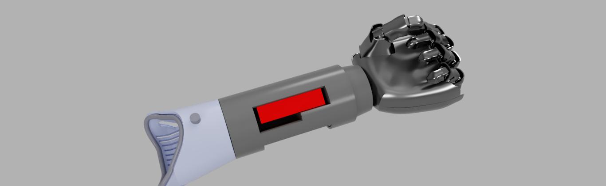
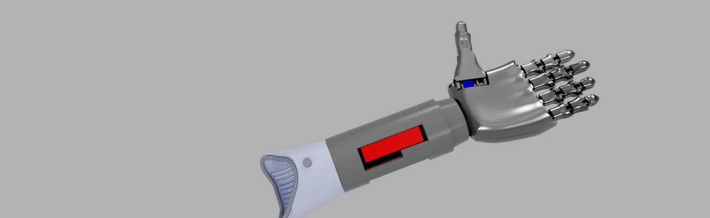
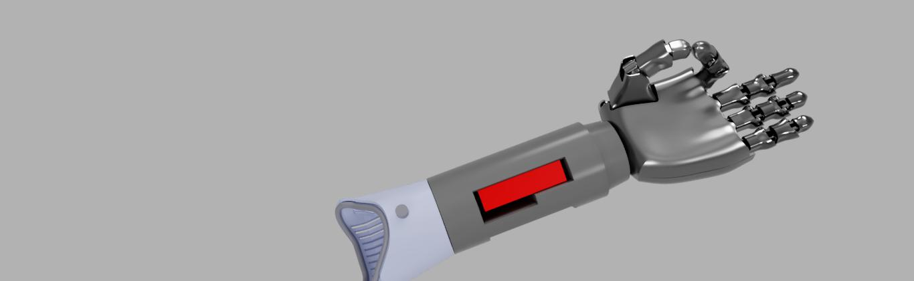
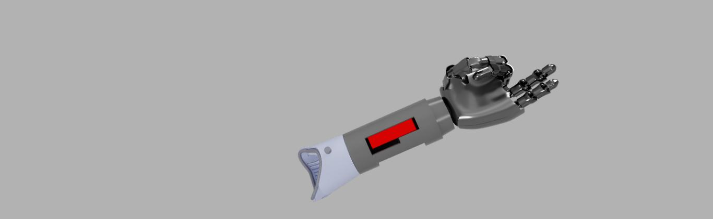
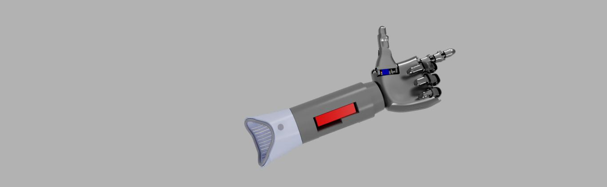
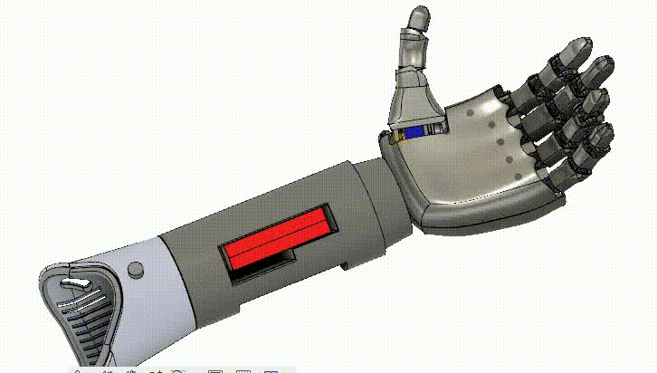

# Bionic Arm

This repository contains the project details, documentation, and images related to the development of an advanced **Bionic Arm**. This project represents a fusion of cutting-edge engineering, biomedical innovation, and design precision, culminating in a functional, customizable robotic arm that enhances human capabilities.

## Overview

The **Bionic Arm** is an automated, electromyography (EMG)-controlled robotic limb, meticulously designed from the ground up. This arm is capable of replicating human arm movements with high accuracy, providing an assistive solution for individuals with limb loss or mobility impairments. 

### Key Features

- **EMG Sensor Integration:** The arm is powered by EMG sensors that detect muscle signals, translating them into precise movements of the robotic limb.

- **3D Printed Design:** The entire arm was 3D printed, allowing for rapid prototyping and customization, ensuring a perfect fit and functionality for various users.

- **Human and Humanoid Adaptation:** Designed for both human clients and humanoid robots, showcasing versatility in application and design adaptability.

- **Customizability:** Each arm can be tailored to meet the specific needs of the user, with adjustable parameters to enhance comfort, functionality, and aesthetic appeal.

## Project Goals

- To create an affordable and functional bionic arm accessible to individuals with mobility impairments.
- To explore the integration of EMG technology in robotics for precise and responsive control.
- To advance the field of prosthetics through innovative design and engineering techniques.

## Media

## Installation & Usage

NA

## Contribution

We welcome contributions from the community! Please refer to the `CONTRIBUTING.md` file for guidelines on how to contribute to this project.

## License

This project is licensed under the MIT License - see the `LICENSE` file for details.

## Acknowledgments

Special thanks to [List of contributors, institutions, and resources] for their support and inspiration in the development of this project.
